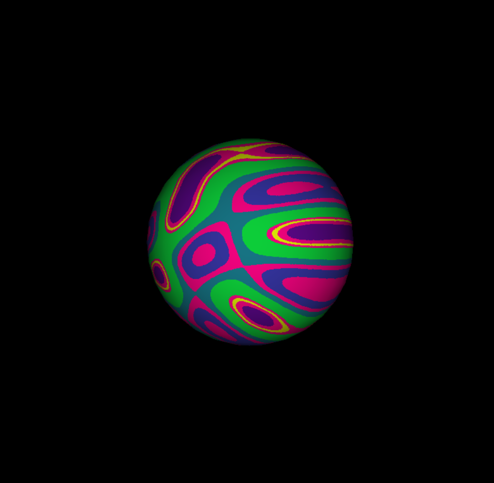
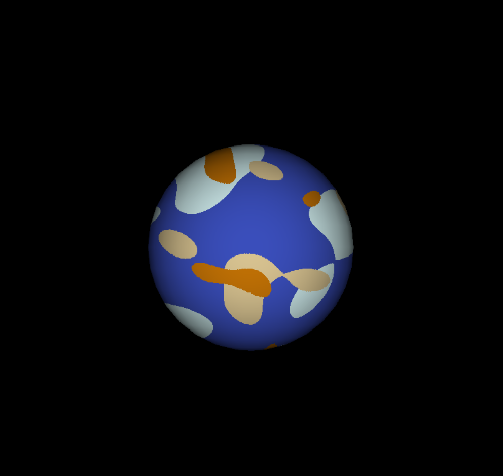

# Proyecto 1 - Space Travel

El proyecto consiste en simular la exporación espacial en un sistema solar. Esto se realiza a partir de la aplicación de un pipeline de renderizado, que permite la creación de ambientes visuales dinámicos. 

Esta simulación incluye diferentes cuerpos celestes, tales como estrellas, planetas y lunas; permite la navegación en una nave espacial e incluye detalles como sombras, órbitas y la rotación y traslación de los planetas.

## Resultado final

## Cuerpos celestes

|  |  |
|------------  | -------------  |
|  |  |  |

## Controles

Los controles de la simulación son los siguientes:

| Tecla | Descripción |
| --- | --- |
| `up arrow` | La nave avanza en dirección de su punta. |
| `down arrow` | La nave retrocede en dirección contraria a su punta |
| `left arrow` | La nave gira hacia la izquierda. |
| `right arrow` | La nave gira hacia la derecha. |
| `w` | La nave se eleva.|
| `s` | La nave desciende. |
| `r` | La nave se teletransporta a la posición inicial |
| `t` | Mientras se mantenga presionada, la nave sigue al planeta Tierra. |
| `y` | Mientras se mantenga presionada, la nave sigue al planeta 3. |
| `u` | Mientras se mantenga presionada, la nave sigue al planeta 4. |